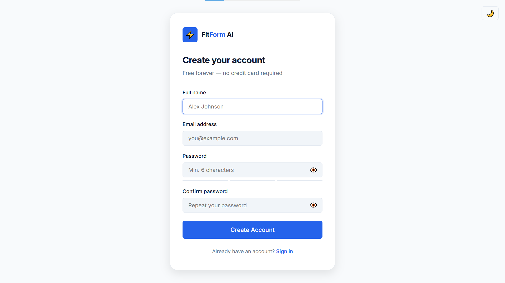
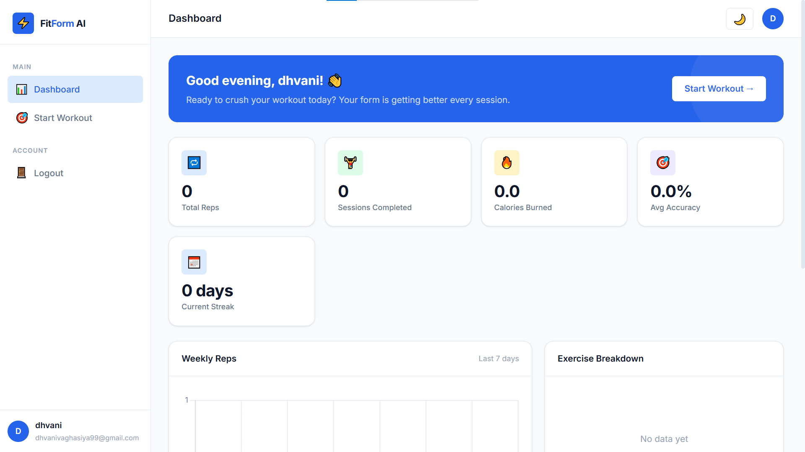
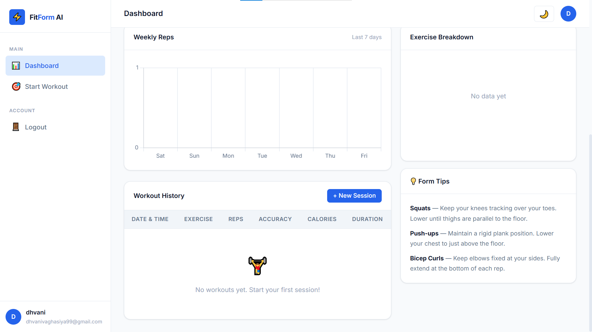
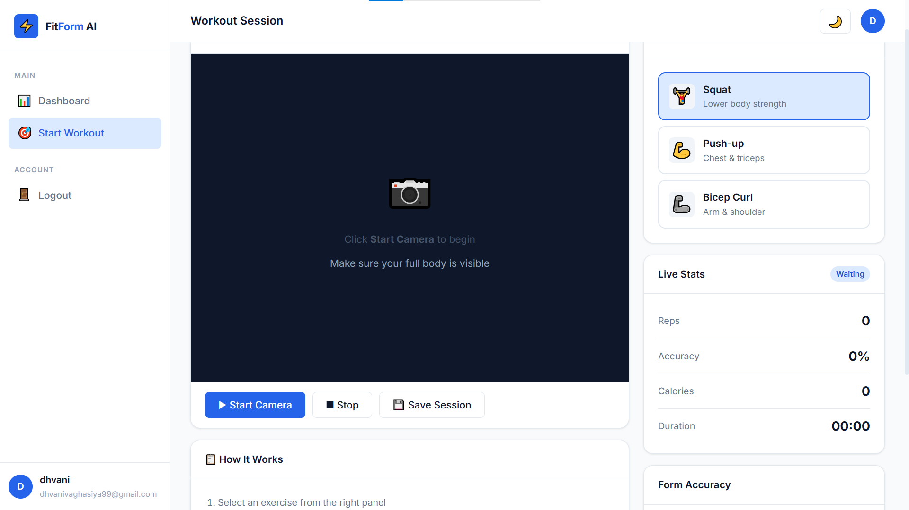
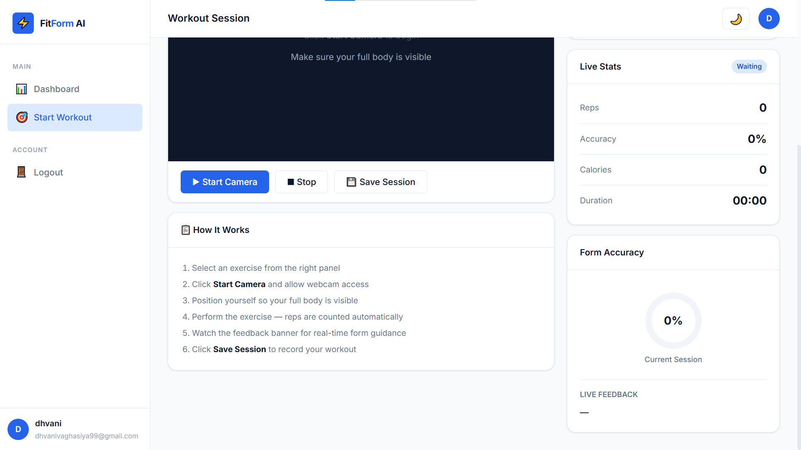

#  FitForm AI

### Real-Time AI Fitness Form Correction System

FitForm AI is a real-time AI-powered fitness web application that helps users improve their exercise posture using computer vision and pose estimation. The application uses webcam input to detect body movements, analyze exercise form, count repetitions automatically, and provide live workout feedback.

Built with Python, Flask, OpenCV, and MediaPipe, the project focuses on creating an interactive and user-friendly fitness experience with workout tracking and analytics.

##  Features

* Real-time body posture detection
* AI-based exercise form correction
* Automatic repetition counting
* Squat, Push-up, and Bicep Curl tracking
* Live workout feedback
* User authentication system
* Workout history tracking
* Calories estimation
* Dashboard analytics
* Dark mode support
* Responsive and modern UI

# Technologies Used

- Frontend: HTML, CSS, JavaScript
- Backend: Python, Flask
- Computer Vision: OpenCV, MediaPipe
- Database: SQLite
- Authentication: Flask-Login
- Charts & Analytics: Chart.js
- Version Control: Git, GitHub

# Project Structure

ai-fitness-form-corrector/
│
├── ai/
├── backend/
├── static/
│   ├── css/
│   ├── js/
│
├── templates/
├── screenshots/
├── app.py
├── config.py
├── requirements.txt
└── README.md

#  Screenshots

# User Login Page

# User Registration Page

# Dashboard Overview

# Workout Analytics

# Exercise Selection Interface

# Live Workout Session

# How It Works

1. User logs into the application
2. Webcam captures live body movement
3. MediaPipe detects body landmarks
4. Joint angles are calculated
5. Exercise posture is analyzed
6. Repetition count updates automatically
7. Live feedback is displayed during workout
8. Workout sessions are saved for analytics

# Future Improvements

* More exercise support
* AI workout recommendations
* Voice assistant integration
* Mobile application support
* Cloud deployment

